Six guns (a pistol, a revolver, a shotgun, a rifle, a scoped rifle and a machine gun) and a
**rocket launcher** that locks onto its target. Every gun, part, magazine and lock-on chip is
made at the **weapons workbench**, not the crafting table. Guns fire on left click, take
magazines you fill yourself, kick when they fire and settle back, aim down their sights, and
show what's loaded in a counter beside the hotbar.

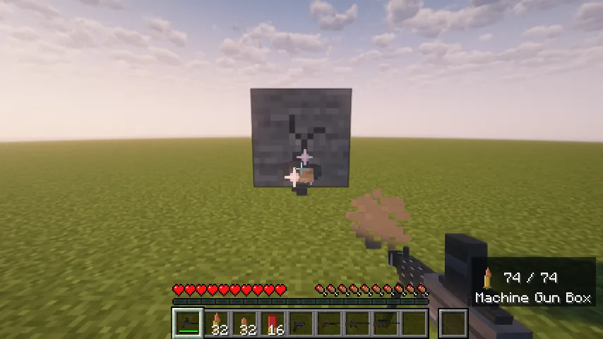

## Quick start

1. **Get steel.** Steel ingots come from [Metals and Materials](/wiki/metals-and-materials):
   three iron and a coal make three.
2. **Make a weapons workbench** at a crafting table: three steel over a plank, a crafting table
   and a plank, over three planks.
3. **Make the parts and the gun** at the workbench (see [Recipes](#recipes)). Point at a gun and
   press **R** in EMI: its page shows the workbench recipe, and **+** fills the bench's grid for
   you.
4. **Make ammunition** at a crafting table, and a **magazine** for your gun at the workbench.
5. **Fill the magazine:** right-click it and press **Fill**.
6. **Shoot:** left click. **R** reloads.

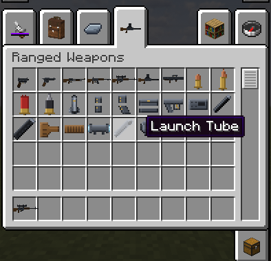

## Controls

| Key | What it does |
|---|---|
| **Left click** | Fire. Hold it for the machine gun; every other gun fires once per click. |
| **Left Alt** (hold) | Aim down the sights: tighter spread and a slight zoom. The scoped rifle looks through its scope (4× zoom). |
| **R** | Reload: change magazines, or top up a revolver or shotgun. |
| **Shift + R** | Swap to your next magazine, or change the kind of round. |
| **Right click** | Does what it always does: opens doors and chests, trades. (On the launcher: raises the seeker.) |
| **F1** | Hides the counter with the rest of the HUD. |

- A gun in your hand doesn't swing, hit or mine. Firing stops a sprint, like drawing a bow.
- A gun in your **off hand** does nothing.
- In **creative** every gun fires without ammunition and never reloads.

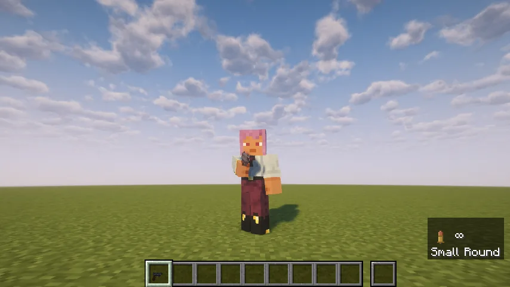

## The guns

| Gun | Fires | Holds | Damage a hit | At range | Lasts |
|---|---|---|---|---|---|
| **Pistol** | once per click, quickly | magazine of 15 small rounds | 6 | weaker past 10 blocks, half past 28 | 800 shots |
| **Revolver** | once per click | cylinder of 6 medium rounds | 10 | weaker past 14 blocks, half past 36 | 700 |
| **Shotgun** | once per click, then a pump | tube of 6 shells or slugs | 6 pellets of 4 | weaker past 5 blocks, a fifth past 18 | 500 |
| **Rifle** | once per click | magazine of 30 medium rounds | 12 | full damage | 700 |
| **Scoped rifle** | once per click, then a bolt | the rifle's magazine | 16 | full damage | 600 |
| **Machine gun** | held: every 3 ticks | box of 75 medium rounds | 6 | full damage | 1200 |

- The pistol and revolver are one-handed; the rest are held in both hands.
- Every shot pushes what it hits. Every pellet and every round counts.
- Rounds shatter glass and lanterns at once, from any gun. Nothing else ever breaks: other blocks only crack, and the cracks heal. (The rocket launcher's blast still breaks blocks.)
- Nearby players hear the shot; players 16 to 64 blocks away hear a far report.

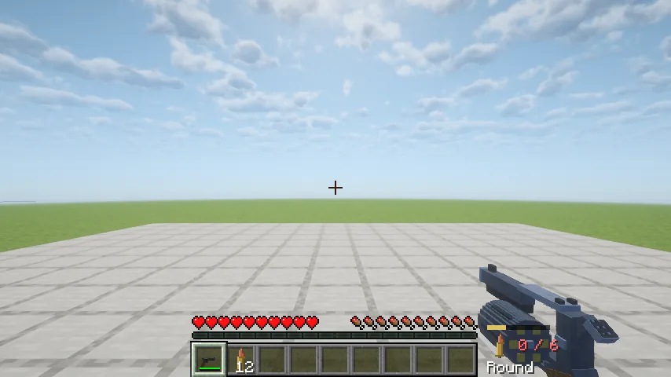

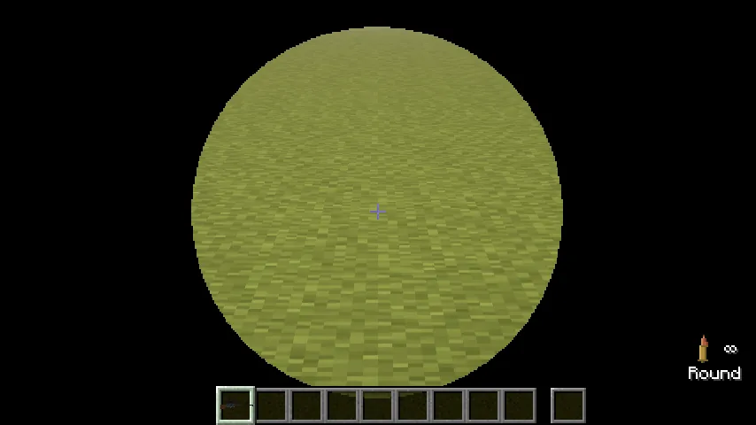

## Ammunition

Made at a **crafting table**. Rounds stack to 99.

| Round | Recipe | Makes | Used by |
|---|---|---|---|
| **Small round** | an iron nugget over gunpowder over an iron nugget | 10 | pistol |
| **Medium round** | an iron nugget over gunpowder over a copper nugget | 8 | revolver, rifles, machine gun |
| **Shell** | paper over gunpowder over an iron nugget | 4 | shotgun: six pellets of 4, spread wide |
| **Slug** | paper over gunpowder over an iron ingot | 4 | shotgun: one round of 18, almost no spread, reaches 30 blocks |

## Magazines and reloading

The pistol, the rifles and the machine gun need a **magazine**: a pistol magazine (15 small
rounds), a rifle magazine (30 medium; the rifle and the scoped rifle share it) or a machine gun
box (75 medium). Each is two steel, made at the workbench. A rifle magazine never fits the
machine gun.

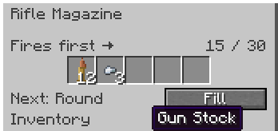

- **Filling:** right-click a magazine. The row of slots fills left to right, and the leftmost
  fires first. **Fill** takes rounds from your inventory. You can mix kinds: they fire in order.
- **Reloading:** **R** takes out the magazine in the gun (whatever's left in it stays in it) and
  puts in the first loaded magazine you carry, hotbar first. Pulling the trigger on an empty gun
  does the same. With no loaded magazine, the gun just clicks.
- **Shift + R** walks through every magazine you carry, one each press.
- **How long:** a pistol magazine change takes 1.2 seconds, a rifle's 1.5, the machine gun's 2.5.
  You can't fire meanwhile.
- **Stacking:** magazines stack eight to a slot when they hold the same load, name and dye. Rename
  one in an anvil, or dye it in a crafting grid, and the counter shows it.
- **The revolver** has no magazine: **R** tops its cylinder up from loose medium rounds (2.4
  seconds); **Shift + R** unloads it and switches to the next kind.
- **The shotgun's tube** works the same way with shells and slugs: **R** tops it up, **Shift + R**
  unloads it and loads the next kind you carry.

### Magazines or loose rounds: your choice

In **Mods → Ranged Weapons Mod → Config**, *ammunition feed* is **Magazines** (the default, all of
the above) or **Loose**: every gun then loads loose rounds straight in, like the shotgun, up to
its own capacity. Loose rounds come from your pockets first, then from your backpacks. It's your
own setting: other players can use the other one on the same server.

## The ammo counter

Beside the hotbar while you hold a gun: the next round's icon, and **rounds loaded / every round
a reload can reach**, loaded ones included. A full rifle with two full magazines in your pack
reads `30 / 90`. The loaded number turns red when a fifth is left. Under it is the magazine's name
(or *No magazine* in red), and a bar while you reload.

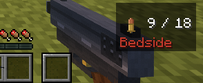

## Recoil and aiming

- Each shot **kicks** your view up and a little sideways, then it settles back by itself. Full
  auto climbs to a steady height and comes down when you stop. Nothing fights your mouse.
- Hold **Left Alt** to **aim**: the spread tightens and the view leans in. Through the scoped rifle
  it's a real scope.
- Recoil and zoom can be turned down in the mod's client config.

## The weapons workbench

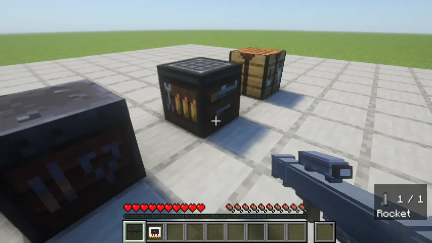

- **Recipe:** three steel over a plank, a crafting table and a plank, over three planks (at a
  crafting table).
- **Its screen:** a 3×3 grid on the left for guns, parts, magazines and chips. On the right is
  the **fittings** slot: put a rocket launcher in it and a slot for its **lock-on chip** opens
  underneath.
- It keeps nothing: whatever's in it comes back to you when you close it.
- A crafting table can't make any of these, and neither can a Warehouse Manager.
- The workbench's recipes aren't in the recipe book. **EMI** shows them under "Weapons
  Workbench", and its **+** button fills the grid for you.

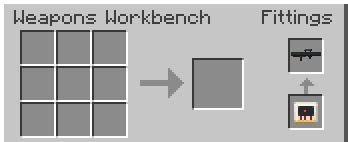

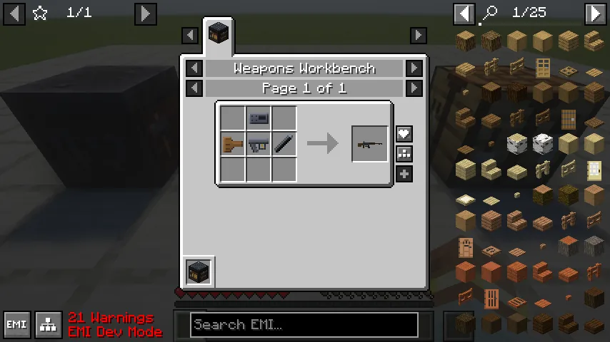

## Recipes

Guns are built from parts, all at the workbench.

| Part | Recipe |
|---|---|
| **Lower Receiver** | three steel across the top, a redstone under the middle |
| **Upper Receiver** | four steel in a square |
| **Gun Barrel** | three iron ingots in a row |
| **Heavy Barrel** | a barrel and two steel, anywhere in the grid |
| **Gun Stock** | two planks over a plank and a stick |
| **Shotgun Pump** | a plank above a stick above a plank, in one column |
| **Rifle Scope** | a glass pane, an iron ingot, a glass pane in a row |

| Gun | Assembly |
|---|---|
| **Pistol** | lower receiver and barrel, in a row |
| **Revolver** | upper receiver beside a barrel, the lower receiver under the upper |
| **Shotgun** | stock, lower receiver and barrel across; the pump under the barrel |
| **Rifle** | the upper receiver over the lower; stock to its left, barrel to its right |
| **Scoped Rifle** | a scope over a rifle |
| **Machine Gun** | as the rifle, with a heavy barrel |

## The rocket launcher

It's a gun: two hands, one rocket in the tube, left click fires, and **R** (or an empty trigger)
reloads in 2.5 seconds from anything you carry, backpacks included.

### Locking on

The launcher only locks on with a **lock-on chip** fitted at the workbench. Without one it fires
straight, and the sight says "No lock-on chip".

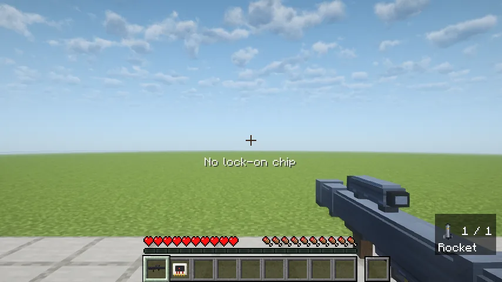

1. **Hold right click** (or the aim key) to raise the seeker.
2. **Keep the target in the reticle for 1.5 seconds.** Amber brackets close on it with a rising
   growl.
3. A **red diamond** and a steady tone: it's **locked**. You can now look away, lower the sight and
   walk. The lock holds until you fire, put the launcher away, or the target dies, leaves, or gets
   more than 128 blocks away.

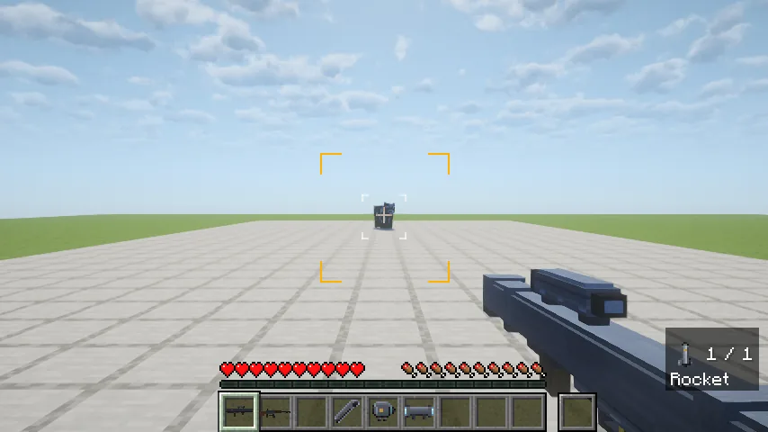

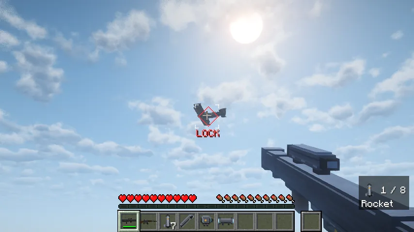

- **A chip gives 8 guided launches.** Its durability bar and the launcher's tooltip count them
  down. Straight shots and locks you never fire cost nothing. The last one burns the chip out.
- **What locks:** anything alive except armour stands (players too, in survival or adventure), and
  vehicles: boats, minecarts, Vanilla Wheels' vehicles, ships, Immersive Aircraft's aircraft and
  planes. Never blocks, item frames, paintings, dropped items or projectiles.

### The rocket

- It leaves the tube slowly, then its motor lights. A locked rocket **leads its target**, but it
  turns only so fast, so a late sidestep can beat it. An unlocked one flies straight.
- It explodes on hitting anything, on coming within a block and a half of its target, or after
  eight seconds. A hit within **4 blocks** of you is a dud: a puff, no blast.
- The blast is a creeper's and breaks blocks. A Warehouse Manager's claimed chests are blast-proof.

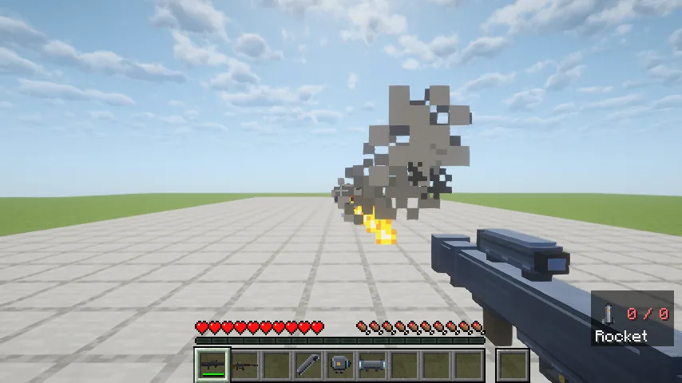

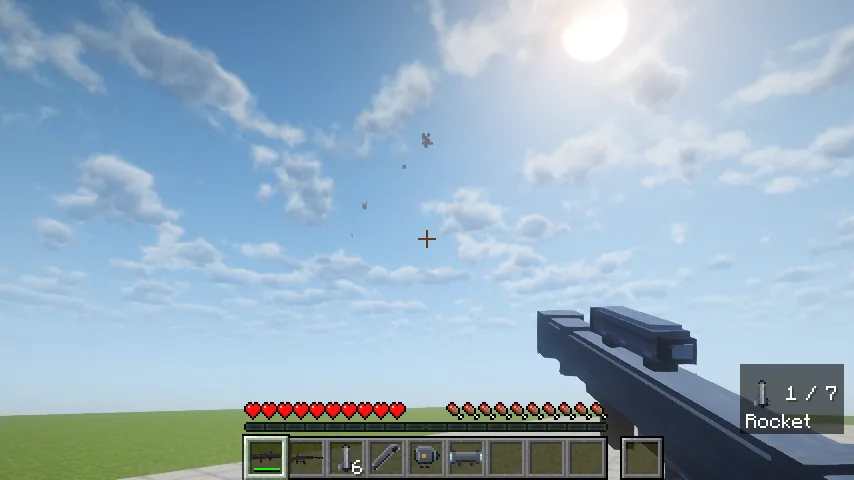

| Item | Recipe (at the workbench, except the rocket) |
|---|---|
| **Launch tube** | eight steel in a ring |
| **Seeker** | two gold ingots and a diamond over a scope, over a block of redstone |
| **Launcher** | the seeker over a stock, a lower receiver and the tube |
| **Lock-on chip** | gold nuggets in the corners, redstone above and below, quartz either side of a comparator |
| **Rocket** (crafting table, one a craft) | redstone over steel, TNT and steel, over blaze powder |

### When it won't lock

- **"No lock-on chip" under the crosshair:** fit a chip at the workbench, or the last one burnt out.
- **Nothing happens on a target:** it isn't something that locks (see above), you can't see it
  from where you stand, or it's more than 30° off where you're looking.
- **"LOCK" with no diamond:** the target is too far for your game to draw, but the lock holds.
- **A rocket went off at your feet without a blast:** a dud. It hit something within 4 blocks.
